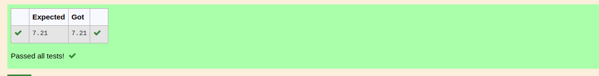

# DISTANCE-BETWEEN-TWO-POINTS

## AIM:
To write a python program to find the distance two 2 points

## ALGORITHM:
### Step 1: 
Get the two list forom the user

### Step 2: 
import the math module

### Step 3: 
Substitute the values in the distance formula  

### Step 4: 
print the value useing the format function

### Step 5: 
Stop the program

### PROGRAM:
```python
#Program to find the distance between two points.
#Developed by: PRAVEEN D 
#RegisterNumber: 22005917
import math
l1=(4,2)
l2=(10,6)
distance=math.sqrt(((l2[0]-l1[0])**2)+((l2[1]-l1[1])**2))
print(round(distance,2))
```
### OUTPUT:



### RESULT:

Thus distance between two points are sucessfully executed